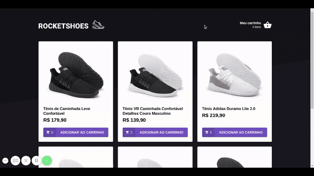

<h1 align="center">
<br>
RocketShoes
</h1>

<p align="center">Online shoes store empowered by ReactJS :shoe:</p>

</p>

[//]: # (Add your gifs/images here:)
<div align="center">
  
</div>

<hr />

## Tools

[//]: # "Add the features of your project here:"

This app features was developed with some of latest tools and practices in web development!

- ⚛️ **ReactJS** — A JavaScript lib that provides a way to create web apps
- :nail_care: **StyledComponents** — One of the new ways to use CSS in modern JavaScript.
- :truck: **API Integration** — Axios, a JS lib, used to handle HTTP requests/responses of  third party API.
- :handbag: **Redux** — A predictable state container for JavaScript apps.
- :arrows_counterclockwise:**Redux-Saga** —  A redux library that aims to make application side effects.

## Getting started

Clone repo:

```
$ git clone https://github.com/paulohlips/rocketshoes
```

Inside of projects folder, install all dependencies:

```
$ yarn (or npm install)
```

Run json-server (fake API) on port 3333:

```
$ json-server server.json -p 3333 -w
```

To run the front-end:

```
$ yarn start (or npm start)
```

Project will be running on http://localhost:3000

## License

This project is licensed under the MIT License - see the [LICENSE](https://opensource.org/licenses/MIT) page for details.
